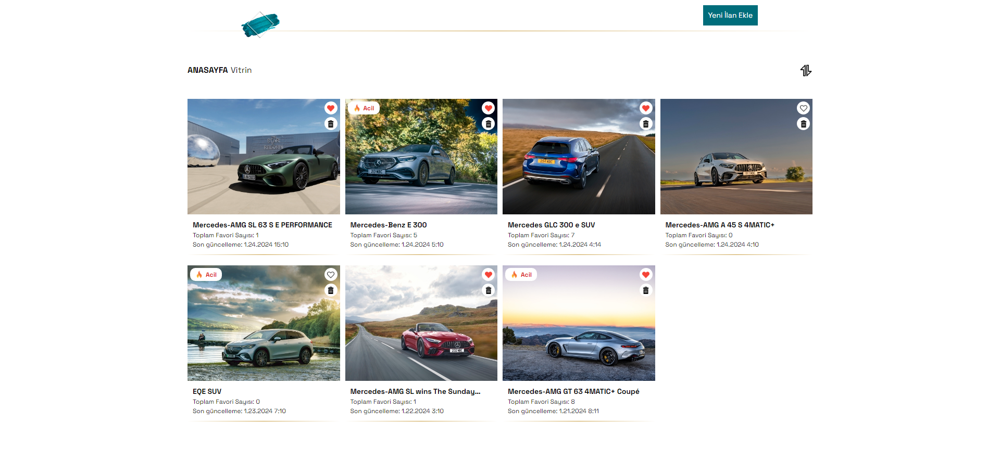
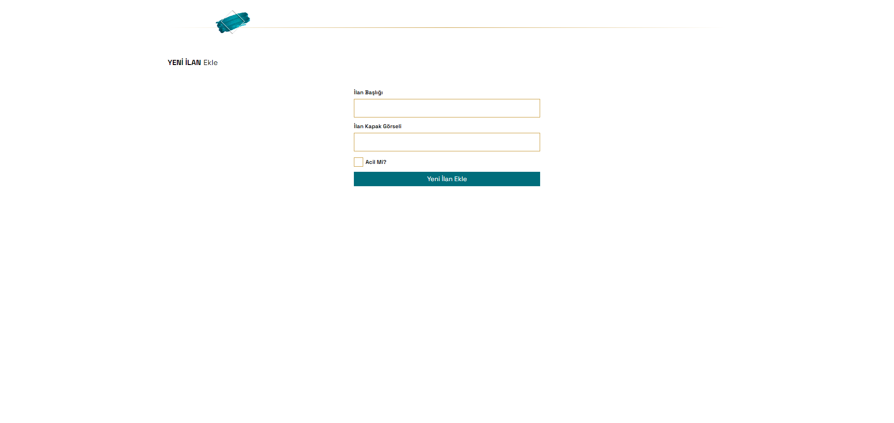
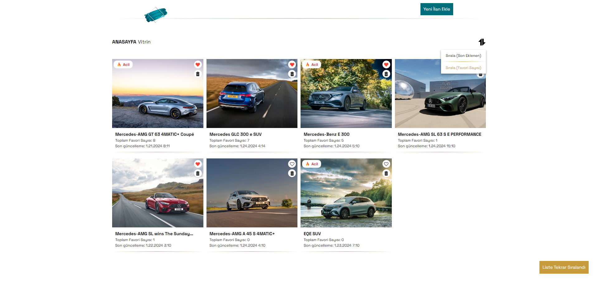
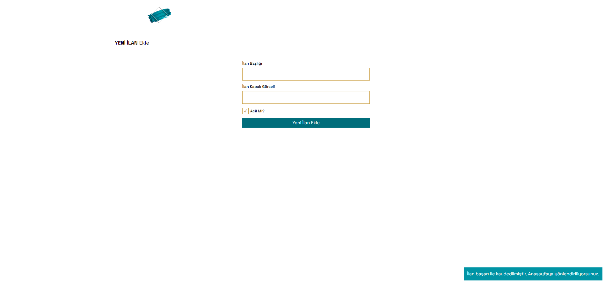

# The CodeBase



## List APP

Visit Project = [The CodeBase Case Study](https://the-code-base-case-study.vercel.app/)<br>
API URL = [API](https://orders-rest-api.vercel.app/)

#### A list project was created with this case study.

- Project written in Next.js
- My object was converted into a Restful API with Node.js and launched on the Vercel platform.
- The project itself was also deployed on Vercel.
- The API I wrote supports GET, POST, PATCH and DELETE methods.
- In the project, a dynamic structure was established by paying attention to React rendering and state management. Context API was used to provide and manage this structure.
- Sass was used for the css part. In this context, examples of dynamic operations with scss are available in the project.
- Functional coding was done in the whole project. In this context, the operations to be performed with auxiliary functions were written under the utils folder.
- In the project created entirely with components, general components used dynamically were included. For example, input, button etc.
- Completely written code for sorting. No auxiliary library was used.
- Since features such sorting are done with Context API, a structure that is interconnected and works properly has been established thanks to state management. The benefit of this is that, for example, we want to add a new sorting feature; it will be enough to add a new key to our related state.
- Although it is not a responsive design, responsive feature was added.

_Notes:_
_-First of all, I preferred to use json-placeholder for API operations while working in local environment. But then I removed it because this structure was not very compatible with the API I wrote._

_Another important note is the number of favourites. Actually it should also be subtracting from favourite, but I turned it into a counter so that you can test sorting by number of favourites. For testing purposes_

_- I did not prefer to use local storage because the commute operations for local storage negatively affected the rendering performance. To get rid of this situation, I decided to keep my sort key in the API. This gave me flexibility. Because in the future, when I add different sorting keys such as filters etc., I will be able to dynamically change and use them._

_- When I first started coding the project, I used Redux Toolkit but then I switched to Context API. My purpose of using RTK was to control my requests with Redux-saga. Instead, I preferred to write it myself with axios because I didn't need a global store and I didn't want to lose my SSR flexibility. For this reason, I coded using component-based providers._

_- I could have added many more animations and theme changes, but I did the best I could due to time constraints.
But while doing this, I preferred to build the structure accordingly. For example, if I need to add a theme change option, I can add it very simply._

## Dependencies

- React.js
- Next.js
- Styled Reset (Sass)
- Axios

## Installation

```bash
npm install
npm run dev
```

## ScreenShots

Some in-app images

| Image 1                               | Image 2                               |
| ------------------------------------- | ------------------------------------- |
|  |  |
| Homepage                              | Filtered Homepage                     |

| Image 3                                    | Image 4                               |
| ------------------------------------------ | ------------------------------------- |
|  |  |
| Homepage                                   | Add Page                              |
